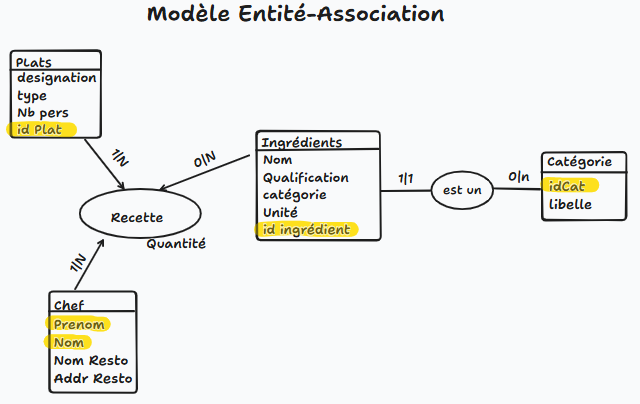

# TP1 Standart SQL - Les recettes du chef

## Question 1

Modéliser le système d'information des organisateurs avec un modèle entité-association.



## Question 2

Transformer ce schéma en modèle relationnel (insertion clés primaires, clés étrangères).


## Question 3

Implémenter ce modèle relationnel sous Oracle à l'aide de scripts SQL.

```sql
CREATE TABLE plat(
    id_Plat NUMBER(10,0) PRIMARY KEY, 
    designation VARCHAR(20),
    type VARCHAR(20),
    nb_pers NUMBER(10,0)
);

CREATE TABLE chef(
    prenom VARCHAR(20),
    nom VARCHAR(20),
    nom_resto VARCHAR(20),
    addr_resto VARCHAR(40),
    CONSTRAINT pkchef PRIMARY KEY (prenom, nom)
);

CREATE TABLE categorie (
    id_Categorie NUMBER(10,0) PRIMARY KEY,
    libelle VARCHAR(20)
);

CREATE TABLE ingredient (
    id_Ingredient NUMBER(10,0) PRIMARY KEY,
    nom VARCHAR(20),
    qualification VARCHAR(20),
    unité VARCHAR(20),
    id_Categorie NUMBER(10,0),
    CONSTRAINT fkCategorie FOREIGN KEY (id_Categorie) REFERENCES categorie(id_Categorie)
);

CREATE TABLE recette (
    quantité NUMBER(10,0),
    prenom VARCHAR(20),
    nom VARCHAR(20),
    id_Plat NUMBER(10,0),
    id_Ingredient NUMBER(10,0),
    CONSTRAINT fkPrenom FOREIGN KEY (prenom) REFERENCES chef(prenom),
    CONSTRAINT fkNom FOREIGN KEY (nom)  REFERENCES chef(nom),
    CONSTRAINT fkPlat FOREIGN KEY (id_Plat)  REFERENCES plat(id_Plat),
    CONSTRAINT fkIngredient FOREIGN KEY (id_Ingredient)  REFERENCES ingredient(id_Ingredient),
    CONSTRAINT pkRecette PRIMARY KEY (nom, prenom, id_Plat, id_Ingredient)
);
```

## Question 4

Insérer quelques données dans ce modèle à l'aide de scripts SQL.

```sql
-- Insertion des catégories d'ingrédients
INSERT INTO categorie (id_Categorie, libelle) VALUES (1, 'Légumes');
INSERT INTO categorie (id_Categorie, libelle) VALUES (2, 'Viandes');
INSERT INTO categorie (id_Categorie, libelle) VALUES (3, 'Épices');
INSERT INTO categorie (id_Categorie, libelle) VALUES (4, 'Fruits');
INSERT INTO categorie (id_Categorie, libelle) VALUES (5, 'Produits laitiers');

-- Insertion des ingrédients
INSERT INTO ingredient (id_Ingredient, nom, qualification, unité, id_Categorie) VALUES (1, 'Carotte', 'Frais', 'Kg', 1);
INSERT INTO ingredient (id_Ingredient, nom, qualification, unité, id_Categorie) VALUES (2, 'Poulet', 'Frais', 'Kg', 2);
INSERT INTO ingredient (id_Ingredient, nom, qualification, unité, id_Categorie) VALUES (3, 'Poivre', 'Moulu', 'g', 3);
INSERT INTO ingredient (id_Ingredient, nom, qualification, unité, id_Categorie) VALUES (4, 'Pomme', 'Bio', 'Pièce', 4);
INSERT INTO ingredient (id_Ingredient, nom, qualification, unité, id_Categorie) VALUES (5, 'Fromage', 'Râpé', 'g', 5);

-- Insertion des plats
INSERT INTO plat (id_Plat, designation, type, nb_pers) VALUES (1, 'Salade César', 'Entrée', 2);
INSERT INTO plat (id_Plat, designation, type, nb_pers) VALUES (2, 'Poulet rôti', 'Plat principal', 4);
INSERT INTO plat (id_Plat, designation, type, nb_pers) VALUES (3, 'Tarte aux pommes', 'Dessert', 6);

-- Insertion des chefs
INSERT INTO chef (prenom, nom, nom_resto, addr_resto) VALUES ('Paul', 'Bocuse', 'L’Auberge', 'Lyon, France');
INSERT INTO chef (prenom, nom, nom_resto, addr_resto) VALUES ('Gordon', 'Ramsay', 'Hell’s Kitchen', 'Las Vegas, USA');
INSERT INTO chef (prenom, nom, nom_resto, addr_resto) VALUES ('Alain', 'Ducasse', 'Le Meurice', 'Paris, France');

-- Insertion des recettes
INSERT INTO recette (quantité, prenom, nom, id_Plat, id_Ingredient) VALUES (200, 'Paul', 'Bocuse', 1, 1);
INSERT INTO recette (quantité, prenom, nom, id_Plat, id_Ingredient) VALUES (1000, 'Gordon', 'Ramsay', 2, 2);
INSERT INTO recette (quantité, prenom, nom, id_Plat, id_Ingredient) VALUES (5, 'Gordon', 'Ramsay', 2, 3);
INSERT INTO recette (quantité, prenom, nom, id_Plat, id_Ingredient) VALUES (3, 'Alain', 'Ducasse', 3, 4);
INSERT INTO recette (quantité, prenom, nom, id_Plat, id_Ingredient) VALUES (150, 'Alain', 'Ducasse', 3, 5);

COMMIT;
```