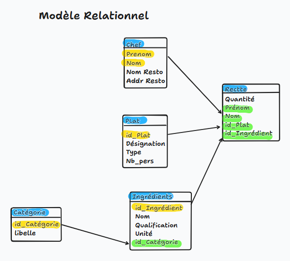

# TP1 Standart SQL - Les recettes du chef

## Question 1

Modéliser le système d'information des organisateurs avec un modèle entité-association.


## Question 2

Transformer ce schéma en modèle relationnel (insertion clés primaires, clés étrangères).



## Question 3

Implémenter ce modèle relationnel sous Oracle à l'aide de scripts SQL.

```sql
CREATE TABLE plat(
    id_Plat NUMBER(10,0) PRIMARY KEY, 
    designation VARCHAR(40),
    type VARCHAR(20),
    nb_pers NUMBER(10,0)
);

CREATE TABLE chef(
    prenom VARCHAR(20),
    nom VARCHAR(20),
    nom_resto VARCHAR(20),
    addr_resto VARCHAR(40),
    CONSTRAINT pkchef PRIMARY KEY (prenom, nom)
);

CREATE TABLE categorie (
    id_Categorie NUMBER(10,0) PRIMARY KEY,
    libelle VARCHAR(20)
);

CREATE TABLE ingredient (
    id_Ingredient NUMBER(10,0) PRIMARY KEY,
    nom VARCHAR(20),
    qualification VARCHAR(20),
    unité VARCHAR(20),
    id_Categorie NUMBER(10,0),
    CONSTRAINT fkCategorie FOREIGN KEY (id_Categorie) REFERENCES categorie(id_Categorie)
);

CREATE TABLE recette (
    quantité NUMBER(10,0),
    prenom VARCHAR(20),
    nom VARCHAR(20),
    id_Plat NUMBER(10,0),
    id_Ingredient NUMBER(10,0),
    CONSTRAINT fkChef FOREIGN KEY (prenom, nom) REFERENCES chef(prenom, nom),
    CONSTRAINT fkPlat FOREIGN KEY (id_Plat) REFERENCES plat(id_Plat),
    CONSTRAINT fkIngredient FOREIGN KEY (id_Ingredient) REFERENCES ingredient(id_Ingredient),
    CONSTRAINT pkRecette PRIMARY KEY (nom, prenom, id_Plat, id_Ingredient)
);
```

## Question 4

Insérer quelques données dans ce modèle à l'aide de scripts SQL.

```sql
-- Insertion des catégories d'ingrédients
INSERT INTO categorie (id_Categorie, libelle) VALUES (1, 'Poisson');
INSERT INTO categorie (id_Categorie, libelle) VALUES (2, 'Légume');
INSERT INTO categorie (id_Categorie, libelle) VALUES (3, 'Épice');

-- Insertion des ingrédients
INSERT INTO ingredient (id_Ingredient, nom, qualification, unité, id_Categorie) VALUES (1, 'Calamar', 'frais', 'kg', 1);
INSERT INTO ingredient (id_Ingredient, nom, qualification, unité, id_Categorie) VALUES (2, 'Tomate', 'bio', 'kg', 2);
INSERT INTO ingredient (id_Ingredient, nom, qualification, unité, id_Categorie) VALUES (3, 'Piment', 'séché', 'g', 3);
INSERT INTO ingredient (id_Ingredient, nom, qualification, unité, id_Categorie) VALUES (4, 'Oignon', 'frais', 'g', 2);

-- Insertion des plats
INSERT INTO plat (id_Plat, designation, type, nb_pers) VALUES (1, 'calamars à l’américaine', 'Poisson', 1);
INSERT INTO plat (id_Plat, designation, type, nb_pers) VALUES (2, 'ratatouille', 'Légume', 2);

-- Insertion des chefs
INSERT INTO chef (prenom, nom, nom_resto, addr_resto) VALUES ('Raymond', 'Livius', 'Chez Raymond', '123 rue de la Mer');
INSERT INTO chef (prenom, nom, nom_resto, addr_resto) VALUES ('Alice', 'Dupont', 'Le Gourmet', '42 avenue des Saveurs');

-- Insertion des recettes
-- Calamars à l’américaine (recette de Raymond Livius)
INSERT INTO recette (quantité, prenom, nom, id_Plat, id_Ingredient) VALUES (0.2, 'Raymond', 'Livius', 1, 1); -- 0.2 kg de Calamars
INSERT INTO recette (quantité, prenom, nom, id_Plat, id_Ingredient) VALUES (0.1, 'Raymond', 'Livius', 1, 2); -- 0.1 kg de Tomates
INSERT INTO recette (quantité, prenom, nom, id_Plat, id_Ingredient) VALUES (0.05, 'Raymond', 'Livius', 1, 3); -- 0.05 kg d’Oignons
INSERT INTO recette (quantité, prenom, nom, id_Plat, id_Ingredient) VALUES (5, 'Raymond', 'Livius', 1, 4); -- 5g de Piment

-- Ratatouille (recette d'Alice Dupont)
INSERT INTO recette (quantité, prenom, nom, id_Plat, id_Ingredient) VALUES (0.2, 'Alice', 'Dupont', 2, 2); -- 0.2 kg de Tomates
INSERT INTO recette (quantité, prenom, nom, id_Plat, id_Ingredient) VALUES (0.1, 'Alice', 'Dupont', 2, 3); -- 0.1 kg d’Oignons

COMMIT;
```

## Question 5

```sql
-- Exemple pour Raymond Livius et le plat "calamars à l’américaine"
SELECT 
    i.nom AS nom_ingredient,
    i.qualification,
    i.unité,
    c.libelle AS categorie,
    r.quantité
FROM 
    recette r
JOIN 
    ingredient i ON r.id_Ingredient = i.id_Ingredient
JOIN 
    categorie c ON i.id_Categorie = c.id_Categorie
JOIN 
    plat p ON r.id_Plat = p.id_Plat
WHERE 
    r.nom = 'Livius'
    AND r.prenom = 'Raymond'
    AND p.designation = 'calamars à l’américaine';

```