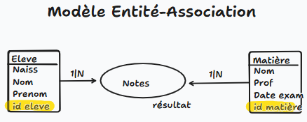
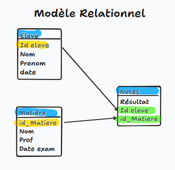

# TP2 Standart SQL - La gestion des notes d’une classe

## Question 1

Modéliser le système d’information à l’aide d’un schéma entité-association



## Question 2

Transformer ce modèle en schéma relationnel.



## Question 3 

Implémenter ce modèle relationnel sous Oracle à l’aide de scripts SQL et insérer quelques données dans ce modèle à l'aide de scripts SQL.

```sql
-- Création des tables

-- Création table élève
CREATE TABLE eleve(
    id_Eleve NUMBER(25,0) PRIMARY KEY,
    prenom VARCHAR(20),
    nom VARCHAR(20),
    date_Naissance Date
);

-- Création table matière
CREATE TABLE matiere(
    id_Matiere NUMBER(15,0) PRIMARY KEY,
    nom VARCHAR(50),
    prof VARCHAR(25),
    date_Exam Date
);

-- Création table notes
CREATE TABLE notes(
    resultat NUMBER(20,0),
    id_Eleve NUMBER(25,0),
    id_Matiere NUMBER(15,0),
    CONSTRAINT fkeleve FOREIGN KEY (id_Eleve) REFERENCES eleve(id_Eleve),
    CONSTRAINT fkmatiere FOREIGN KEY (id_Matiere) REFERENCES matiere(id_Matiere)
);

-- Insertion des données

-- Insertion élèves
INSERT INTO eleve (id_Eleve, prenom, nom, date_Naissance) VALUES (1, 'Alban', 'David', TO_DATE('20-08-2004', 'DD-MM-YYYY'));
INSERT INTO eleve (id_Eleve, prenom, nom, date_Naissance) VALUES (2, 'Baptiste', 'Dauphin', TO_DATE('14-04-2002', 'DD-MM-YYYY'));

-- Insertion matières
INSERT INTO matiere (id_Matiere, nom, prof, date_Exam) VALUES (1, 'Base de données', 'Bayard', TO_DATE('18-04-2002', 'DD-MM-YYYY'));
INSERT INTO matiere (id_Matiere, nom, prof, date_Exam) VALUES (2, 'Gestion de version décentralisée', 'Kovacs', TO_DATE('18-04-2002', 'DD-MM-YYYY'));
INSERT INTO matiere (id_Matiere, nom, prof, date_Exam) VALUES (3, 'Maths', 'Castagnedoli', TO_DATE('18-04-2002', 'DD-MM-YYYY'));

-- Insertion notes Alban 
INSERT INTO notes (resultat, id_Eleve, id_Matiere) VALUES (14, 1, 1);
INSERT INTO notes (resultat, id_Eleve, id_Matiere) VALUES (16, 1, 2);
INSERT INTO notes (resultat, id_Eleve, id_Matiere) VALUES (19, 1, 3);

-- Insertion notes Baptsite
INSERT INTO notes (resultat, id_Eleve, id_Matiere) VALUES (14, 2, 1);
INSERT INTO notes (resultat, id_Eleve, id_Matiere) VALUES (18, 2, 2);
INSERT INTO notes (resultat, id_Eleve, id_Matiere) VALUES (16, 2, 3);
```

## Question 4

Créer des requêtes SQL permettant de retourner \:\
La moyenne de la classe
```sql
-- moyenne de la classe
SELECT AVG(resultat) AS moyenne_classe
FROM notes;
```

La moyenne d’un élève (à partir de ses nom et prénom)
```sql
-- moyenne d’un élève
SELECT AVG(n.resultat) AS moyenne_eleve
FROM notes n
JOIN eleve e ON n.id_Eleve = e.id_Eleve
WHERE e.nom = 'David' AND e.prenom = 'Alban';
```

La moyenne des notes dans une matière (à partir du nom du professeur)
```sql
-- moyenne des notes dans une matière
SELECT AVG(n.resultat) AS moyenne_matiere
FROM notes n
JOIN matiere m ON n.id_Matiere = m.id_Matiere
WHERE m.prof = 'Bayard';
```

La moyenne de chacun des élèves (une seule requête)
```sql
-- moyenne de chacun des élèves
SELECT e.prenom, e.nom, AVG(n.resultat) AS moyenne
FROM notes n
JOIN eleve e ON n.id_Eleve = e.id_Eleve
GROUP BY e.id_Eleve, e.prenom, e.nom;
```

La moyenne de chacune des matières (une seule requête)
```sql
-- moyenne de chacune des matières
SELECT e.prenom, e.nom, AVG(n.resultat) AS moyenne
FROM notes n
JOIN eleve e ON n.id_Eleve = e.id_Eleve
GROUP BY e.id_Eleve, e.prenom, e.nom;
```

La moyenne d’un élève entre 2 dates
```sql
-- moyenne d’un élève entre 2 dates
SELECT AVG(n.resultat) AS moyenne
FROM notes n
JOIN eleve e ON n.id_Eleve = e.id_Eleve
JOIN matiere m ON n.id_Matiere = m.id_Matiere
WHERE e.nom = 'David' AND e.prenom = 'Alban'
  AND m.date_Exam BETWEEN TO_DATE('01-04-2002', 'DD-MM-YYYY') AND TO_DATE('30-04-2002', 'DD-MM-YYYY');
```